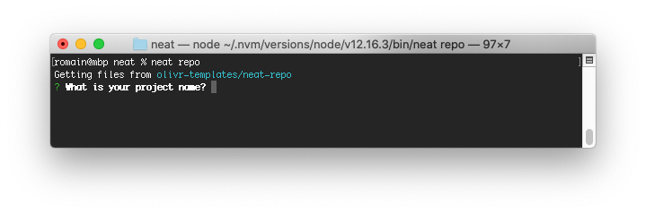
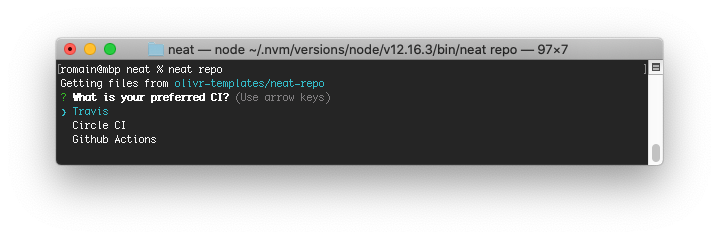
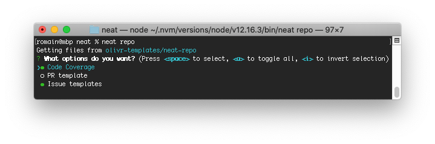

# neat

Neat is a CLI tool and a collection of the neatest repository templates to boost your repos.

<!-- START doctoc generated TOC please keep comment here to allow auto update -->
<!-- DON'T EDIT THIS SECTION, INSTEAD RE-RUN doctoc TO UPDATE -->


- [💾 Installation](#-installation)
- [🔥 CLI usage](#-cli-usage)
  - [Use a "registered" repo](#use-a-registered-repo)
  - [Use any repo](#use-any-repo)
  - [Specify a target folder](#specify-a-target-folder)
  - [Options](#options)
  - [Example use case](#example-use-case)
- [🤘 Creating a neat repo](#-creating-a-neat-repo)
  - [Pre-run](#pre-run)
  - [Symbolic links](#symbolic-links)
  - [Ask questions](#ask-questions)
  - [Replacement pattern](#replacement-pattern)
  - [Replacement filter](#replacement-filter)
  - [Pre-download](#pre-download)
  - [Inject files](#inject-files)
  - [Ignore files](#ignore-files)
  - [Post-run](#post-run)
- [💚 Contributing](#-contributing)
  - [Add your repo to the registered repo list](#add-your-repo-to-the-registered-repo-list)
  - [Top five ways to contribute](#top-five-ways-to-contribute)
  - [Project specifics](#project-specifics)
  - [For maintainers](#for-maintainers)
- [💡 Todo](#-todo)
- [💬 Support](#-support)
- [📜 License](#-license)
- [⭕ About Olivr](#-about-olivr)

<!-- END doctoc generated TOC please keep comment here to allow auto update -->

## 💾 Installation

Install with:

- NPM

  ```sh
  npm install -g neat
  ```

- Yarn

  ```sh
  yarn global add neat
  ```

- Or use directly with NPX

  ```sh
  npx neat repo
  ```

## 🔥 CLI usage

Essentially what Neat does is download files from a remote GitHub repo to a local folder and eventually ask questions and run pre-defined commands that would be specified in a `.neat.yml` at the root of the remote repo.

There is a collection of neat repos in [neat-repos.json](neat-repos.json) (See [contributing](#contributing) if you want to submit yours).
Although we look at the repo at the time of adding it to the list, we cannot vouch for any changes committed after that.

> ⚠️ As a general rule (not just for Neat), you should never execute a remote file without prior verification because it could have been tampered with malicious code.
> As such, it is always recommended to execute remote files in a controlled environment such as a remote CI environment or a local docker container to contain eventual damage.

### Use a "registered" repo

Use a repo name from the [neat-repos.json](neat-repos.json)

Download files in the current working directory (without overwriting existing files):

```sh
neat repo
```

By default the `master` branch is used, if you prefer another branch/tag, you can use the @ notation:

```sh
neat repo@emoji
```

### Use any repo

Download files in the current working directory (without overwriting existing files):

```sh
neat your/repo
```

By default the `master` branch is used, if you prefer another branch/tag, you can use the @ notation:

```sh
neat your/repo@v2
```

### Specify a target folder

Download files in `my-project` (without overwriting existing files):

```sh
neat repo my-project
```

> This is usually used for creating a new repo using a neat template

### Options

#### --force-download

The default behaviour is to skip processing remote files that already exist locally.

Using this flag will overwrite all local files with their remote counterparts.

```sh
neat repo --force-download
```

#### --force-inject

The default behaviour is to skip injecting local files that have already been injected (ie. if the target file contains two occurences of the injection pattern)

Using this flag will force re-injecting those files.

```sh
neat repo --force-inject
```

#### -f, --force

If you wish to use both `--force-download` and `--force-inject`, you can use the alias `--force`or `-f`

> **Note on future versions of Neat**: As new features will be added to Neat, using `--force` will always be the same as combining all the `--force-*` flags. Keep that in mind if you use Neat in automation or if you're a heavy neat user.

So, in the current version, running this:

```sh
neat repo --force
```

Is the same as running this:

```sh
neat repo --force-download --force-inject
```

#### -s, --silent

Don't ask for any user input.
If this flag is used Neat will skip any questions asked by a template and will use answers from `NEAT_ASK_*` environment variables

It is best used in CI environments.

```sh
export NEAT_ASK_PROJECT_NAME="My project"
export NEAT_ASK_SECURITY_CONTACT="me@example.com"
export NEAT_ASK_SUPPORT_URL="https://stackoverflow.com"

neat repo --silent
```

#### -e, --except

Filter out remote files from processing by passing a regular expression.

Example: Process all but markdown files

```sh
neat repo --except "\.md$"
```

> The regular expression is run as case insensitive.

#### -o, --only

Filter remote files to process by passing a regular expression.

Example: Process only markdown files

```sh
neat repo --only "\.md$"
```

> The regular expression is run as case insensitive.

### Example use case

Your organization, maintains a "default" repo which contains files to be used when creating other repositories:

```sh
docs/SECURITY.md
LICENSE
README.md
```

When you create a new repo you can use

```sh
neat organization/default new-repo
```

Or if you already worked in a repo and you forgot to create it from the default repo, you could run from within your repo folder, it will just add new files that are not present in your local folder and will not overwrite any files

```sh
neat organization/default
```

Now, let's say you want to:

- Make sure your repo's security policy is always up to date with your organization's latest security policy
- Add files from a repo template you created for your favourite framework on your personal GitHub account
- Add to your repo any new files added in the organization's default repo
- Add any generic files that you didn't create already from the [neatest repo](https://github.com/olivr-templates/neat-repo)

You could run the following (or add it in your CI pipeline, package.json, pre-commit hook, etc.)

```sh
neat organization/default -f -o docs/SECURITY.md
neat mygithub/favourite-framework
neat organization/default
neat oss
```

This is non invasive: it will not overwrite your files except for `docs/SECURITY.md`

## 🤘 Creating a neat repo

Each Neat repo can contain a `.neat.yml` configuration file which specifies what to do when someone "neats" your repo.

You can find configuration examples in the [examples](examples) folder

### Pre-run

Pre-run commands are run on the local machine before any files are processed.

```yml
pre-run:
  - echo 'I am run at the begining, before any file is downloaded'
```

If you plan for other people to neat your repo, you should make sure these commands can run on any OS, or tell otherwise in your README.

### Symbolic links

Sometimes, it is necessary for one file's content to be another file's content.
Any specified symbolic links are created before downloading any files.

For example, the most common use case is that you have a readme explaining how to use your Neat template. But you don't want this readme to be the default readme once your user has neated your template. Instead, you prepared another readme.

```yml
symlink:
  - README.md: README.tpl.md
```

Essentially, in this example:

- The content of README.md will be replaced with the content of README.tpl.md
- README.tpl.md will be ignored from processing
- Neat will process README.md like any other file, including replacements, injections or even ignoring it.

### Ask questions

When someone neats your repository, you can ask him/her some questions and then use those values to [replace strings](#replacements) or run [any other arbitrary command](#answers-environment-variables).

A question is structured as follows:

```yml
ask:
  - id: project_name
    description: What is your project name?
    default: My project
```

- `id` is the only required field
- `description` is the actual question asked to the user. If it is not set, Neat will use the `id` by replacing underscores by spaces (eg. _Project name_)
- `default` is used to provide default values and determine the question type

Neat supports three question types: _input_, _choice_ and _multiple choice_ that are deducted based on the provided value for `default`

#### Input

If no default value is specified or if the default value is a **string**

```yml
ask:
  - id: project_name
    description: What is your project name?
```



#### Choice

If the default value is a **list of strings**

```yml
ask:
  - id: ci
    description: What is your preferred CI?
    default: [Travis, Circle CI, Github Actions]
```



#### Multiple choice

If the default value is a **list of key/value pairs**

- `true` means this choice is checked by default
- `false` means this choice is unchecked by default

```yml
ask:
  - id: options
    description: What options do you want?
    default:
      - "Code Coverage": true
      - "PR template": false
      - "Issue templates": true
```



#### Replacements

Neat can search the added files and replace certain strings with answers to questions in the added files.

For each question, you can specify if Neat has to make a replacement by adding `replace: true`

```yml
ask:
  - id: project_name
    description: What is your project name?
    replace: true
```

This will have the effect of searching all added files and replacing the question ID in mustache style `{{project_name}}` with the value of the answer (eg. _My project_)

For the multiple choice question type, the answer is a string of comma-space-separated values (eg. _PR template, Issue templates_)

You can change the [pattern](#replacement-pattern) format or [filter](#replacement-filter) which files to search and replace.

If these replacement options are not enough for your use case, you can make use of the [post-run commands](#post-run) to do pretty much anything you like

### Replacement pattern

You can specify which pattern to replace. By default, it will search and replace mustache variables: `{{%s}}`.

**Example:** Replace HTML comments

```yml
ask:
  - id: project_name
    description: What is your project name?
    replace: true
replace_pattern: "<!-- %s -->"
```

### Replacement filter

You can specify which files to run replacements on. By default, it will search and replace in all added files.

**Example:** Make replacements only in markdown and text files

```yml
ask:
  - id: project_name
    description: What is your project name?
    replace: true
replace_filter: \.(md|txt)$
```

### Pre-download

Pre-download commands are run on the local machine before any files are processed but just after asking questions, so you can have access to the [answers environment variables](#answers-environment-variables).

```yml
ask:
  - id: project_name
pre-download:
  - echo $NEAT_ASK_PROJECT_NAME
```

If you plan for other people to neat your repo, you should make sure these commands can run on any OS, or tell otherwise in your README.

### Inject files

You can specify a list of files or command outputs to be "injected" into specific files.

This could be used for example to ensure certain chunks of text are included in a readme, even if the local folder of a user already has a readme when he neats your repo.

You can specify either a `file`, a `command` or an `url` as the source.

```yml
inject:
  - id: hello
    command: echo "hello world"
    target: README.md
  - id: support
    file: readme/support.md
    target: docs/CONTRIBUTING.md
  - id: google
    url: https://google.com
    target: google.html
```

If the target file does not exist, it will be created.

Any replacements will also be applied to each injected chunk (including replacement filter).

If you use a command as the source and plan for other people to neat your repo, you should make sure they can run on any OS, or tell otherwise in your README.

#### Injection pattern

The default pattern is `<!-- id -->` with `id` being the value of the corresponding id (like `<!-- hello -->` in the example above)

Neat will find either:

- Two occurences of the pattern with or without any text in between
- One occurence of the pattern

If it cannot find this pattern in the target file, Neat will add it at the bottom of the file.

You can customize the replacement pattern:

```yml
inject:
  - id: hello
    command: echo "hello world"
    target: README.md
    pattern: "<!-- hello-docs -->"
```

#### Several targets

This example will find the pattern `<!-- hello -->` and replace it with `hello world` in both targets

```yml
inject:
  - id: hello
    command: echo "hello world"
    target: [docs/CONTRIBUTING.md, README.md]
```

#### Inject used in conjuction with ignore

For example, if your neat repo is using a README.md to describe what it can do and how to use it but you don't want this README.md to be downloaded when someone neats it, [you can ignore it](#ignore-files).

```yml
ignore: [README.md]
```

- Using `ignore` in conjunction with `inject`:

  ```yml
  ignore: [README.md]
  inject:
    - id: hello
      command: echo "hello world"
      target: README.md
  ```

  As expected, `README.md` will not be downloaded. However:

  - If Neat is run in a folder that doesn't contain a `README.md` already, it will create it and inject the `hello` section.
  - If Neat is run in a folder that already contains a `README.md`, it will either replace or append the pattern (as described in [Injection pattern](#injection-pattern))

- If the source file for the injection is ignored:

  ```yml
  ignore: [readme/support.md]
  inject:
    - id: support
      file: readme/support.md
      target: README.md
  ```

  As expected, `readme/support.md` will not be downloaded. However:

  - If Neat is run in a folder that doesn't contain a `readme/support.md` already, it will inject into `README.md` the content of `readme/support.md` that is found in your neat repo.
  - If Neat is run in a folder that already contains a `readme/support.md`, it will use that content as the content to inject into `README.md`

### Ignore files

You can specify a list of relative paths to files that should be ignored (aka never downloaded)

You could use it to provide a documentation for your template in a `README.md` but you don't want this to be included when people neat your template:

```yml
ignore: [README.md]
```

> Note: `.neat.yml` is always ignored by default, the only way not to include it is to use a [symbolic link](#symbolic-links)

### Post-run

Post-run commands are run on the local machine after files are processed.

```yml
post-run:
  - echo 'I am run at the end'
```

If you plan for other people to neat your repo, you should make sure these commands can run on any OS, or tell otherwise in your README.

#### Files environment variables

Post-run commands can access several environment variables.
These variables will never include files and directories filtered out using the --only or --except flags because they are simply not processed by Neat.

The most used environment variable is `NEAT_ADDED_FILES` because it contains a lit of files that were effectively added in the repo.

| Environment variable    | Description                                                                                                |
| ----------------------- | ---------------------------------------------------------------------------------------------------------- |
| NEAT_ALL_FILES_DIRS     | Space-separated list of all files and directories that were processed, whether they were added or skipped. |
| NEAT_ADDED_FILES_DIRS   | Space-separated list of files and directories that were added.                                             |
| NEAT_SKIPPED_FILES_DIRS | Space-separated list of files and directories that were skipped.                                           |
| NEAT_ALL_FILES          | Space-separated list of all files that were processed, whether they were added or skipped.                 |
| NEAT_ADDED_FILES        | Space-separated list of files that were added.                                                             |
| NEAT_SKIPPED_FILES      | Space-separated list of files that were skipped.                                                           |
| NEAT_ALL_DIRS           | Space-separated list of all directories that were processed, whether they were added or skipped.           |
| NEAT_ADDED_DIRS         | Space-separated list of directories that were added.                                                       |
| NEAT_SKIPPED_DIRS       | Space-separated list of directories that were skipped.                                                     |

#### Answers environment variables

In addition, if some questions were asked, their answers are available as environment variables constructed with the question ID in uppercase.

Examples:

- Will produce the environment variable `NEAT_ASK_PROJECT_NAME` whose value will be a string of the user's answer (eg. _My project_)

  ```yaml
  - id: project_name
  ```

- Will produce the environment variable `NEAT_ASK_CI` whose value will be a string of the user's answer (eg. _Circle CI_)

  ```yaml
  - id: ci
    default: [Travis, Circle CI, Github Actions]
  ```

- Will produce the environment variable `NEAT_ASK_OPTIONS` whose value will be a string of comma-separated answers (eg. _PR template, Issue templates_)

  ```yaml
  - id: options
    default:
      - "Code Coverage": true
      - "PR template": false
      - "Issue templates": true
  ```

## 💚 Contributing

[](https://github.com/olivr-com/neat/actions?query=workflow%3A%22Build+%26+Publish+CLI%22)
[](https://codecov.io/gh/olivr-com/neat)

### Add your repo to the registered repo list

If you created a neat repo you're proud of, please add it to the registered repos list:

1. Fork this repo

2. Add your repo to [neat-repos.json](neat-repos.json)

   - The syntax is `"name": "repo/path"`. As a result, running `neat name` will fetch `repo/path`
   - Insert your repo in alphabetical order
   - Only use strings, numbers and dashes (-) in the neat name. It must not start or end with a dash

3. [Open a pull request](https://github.com/olivr-com/neat/compare)

### Top five ways to contribute

⭐ Star this repo: it's quick and goes a long way! [🔝](#top)

🗣️ [Spread the word](docs/CONTRIBUTING.md#spread-the-word)

🐞 [Report bugs](docs/CONTRIBUTING.md#report-bugs)

✅ [Resolve issues](docs/CONTRIBUTING.md#resolve-issues)

📝 [Improve the documentation](docs/CONTRIBUTING.md#improve-the-documentation)

Please see the [docs/CONTRIBUTING.md](docs/CONTRIBUTING.md) for more information.

### Project specifics

Install dependencies:

```sh
yarn install
```

Run tests:

```sh
yarn test
```

Run neat:

```sh
./bin/run
```

Use your code as the neat version you use on your system:

```sh
yarn link
```

### For maintainers

We follow [Semantic versioning](https://semver.org/) and make use of [Yarn version](https://classic.yarnpkg.com/docs/cli/version) to manage new versions.

#### Patch

When you make backwards compatible bug fixes:

```sh
yarn version --patch
```

#### New feature

When you add functionality in a backwards compatible manner:

```sh
yarn version --minor
```

#### Major version

When you make incompatible API changes:

```sh
yarn version --major
```

## 💡 Todo

- [ ] Overwrite remote config with local config (Add a .neat.yml locally with for example `remote: [repo: [inject: [...]]]` and it will ignore any injections from the remote)
- [ ] GitHub action running on a schedule to perform automated verification of pre/post run commands in list of neatest repos and add the SHA of the latest commit to `neatest-repos.json`
- [ ] When neating a repo, verify which SHA is used and display a warning if it has not been verified yet
- [ ] Provide a Docker image with Neat already installed to easily run it in a containerized environment

<!-- auto-support -->

## 💬 Support

Join [Olivr](https://keybase.io/team/olivr) on Keybase 🔐

Or you can use our [Reddit community](https://www.reddit.com/r/olivr/)

<!-- auto-support -->

<!-- auto-license -->

## 📜 License

This project is licensed under the Apache 2.0 License - see the [LICENSE](LICENSE) file for details

<!-- auto-license -->

<!-- auto-about-org -->

## ⭕ About Olivr

[Olivr](https://olivr.com) is an AI co-founder for your startup.

<!-- auto-about-org -->
